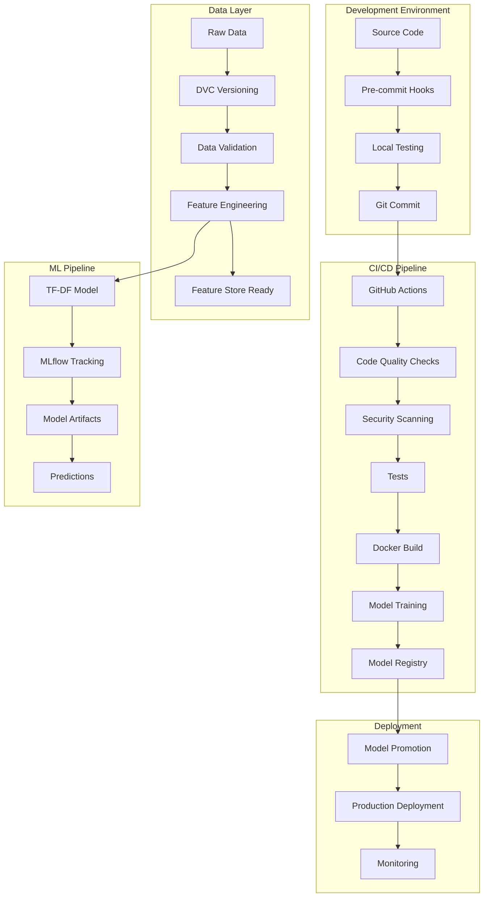

# Design Document

## Overview

The enterprise ML infrastructure will transform the existing Kaggle Titanic TF-DF pipeline into a production-ready system following MLOps best practices. The design emphasizes reproducibility, testability, observability, and security while maintaining the original model's performance.

## Architecture

### High-Level Architecture



### Project Structure

```
titanic-enterprise/
├── .github/
│   └── workflows/
│       ├── ci.yml                 # Main CI pipeline
│       ├── security.yml           # Security scanning
│       └── deploy.yml             # Deployment workflow
├── .kiro/
│   └── specs/                     # Feature specifications
├── configs/
│   ├── config.yaml               # Main Hydra config
│   ├── model/
│   │   └── tfdf.yaml            # TF-DF model config
│   ├── data/
│   │   └── titanic.yaml         # Data config
│   └── experiment/
│       └── baseline.yaml        # Experiment config
├── data/
│   ├── raw/                     # Original datasets
│   ├── processed/               # Processed datasets
│   └── .dvc                     # DVC configuration
├── src/
│   ├── titanic_enterprise/
│   │   ├── __init__.py
│   │   ├── data/
│   │   │   ├── __init__.py
│   │   │   ├── loader.py        # Data loading utilities
│   │   │   ├── preprocessor.py  # Data preprocessing
│   │   │   ├── validator.py     # Pandera schemas
│   │   │   └── quality.py       # Data quality checks
│   │   ├── features/
│   │   │   ├── __init__.py
│   │   │   ├── engineering.py   # Feature engineering
│   │   │   └── feast_views.py   # Feast feature definitions
│   │   ├── models/
│   │   │   ├── __init__.py
│   │   │   ├── tfdf_model.py    # TF-DF implementation
│   │   │   └── base.py          # Base model interface
│   │   ├── training/
│   │   │   ├── __init__.py
│   │   │   ├── trainer.py       # Training orchestration
│   │   │   └── evaluator.py     # Model evaluation
│   │   ├── inference/
│   │   │   ├── __init__.py
│   │   │   └── predictor.py     # Prediction pipeline
│   │   └── utils/
│   │       ├── __init__.py
│   │       ├── config.py        # Configuration utilities
│   │       ├── logging.py       # Logging setup
│   │       └── mlflow_utils.py  # MLflow helpers
├── tests/
│   ├── unit/                    # Unit tests
│   ├── integration/             # Integration tests
│   ├── data/                    # Test data
│   └── conftest.py             # Pytest configuration
├── docker/
│   ├── Dockerfile              # Main application image
│   ├── Dockerfile.dev          # Development image
│   └── docker-compose.yml      # Local development stack
├── docs/
│   ├── model_card.md           # Model documentation
│   ├── promotion_checklist.md  # Deployment checklist
│   └── api/                    # API documentation
├── scripts/
│   ├── setup_env.sh           # Environment setup
│   ├── run_pipeline.py        # Pipeline runner
│   └── generate_submission.py  # Submission generator
├── .pre-commit-config.yaml    # Pre-commit configuration
├── .gitignore                 # Git ignore rules
├── .gitleaks.toml            # Secret scanning config
├── pyproject.toml            # Python project config
├── uv.lock                   # Dependency lockfile
├── Makefile                  # Build automation
├── dvc.yaml                  # DVC pipeline definition
└── README.md                 # Project documentation
```

## Components and Interfaces

### Data Layer Components

#### DataLoader
```python
class DataLoader:
    def load_raw_data(self) -> Tuple[pd.DataFrame, pd.DataFrame]
    def load_processed_data(self) -> Tuple[pd.DataFrame, pd.DataFrame]
    def validate_data_integrity(self, df: pd.DataFrame) -> bool
```

#### DataValidator
```python
class DataValidator:
    def validate_schema(self, df: pd.DataFrame) -> ValidationResult
    def check_data_quality(self, df: pd.DataFrame) -> QualityReport
    def detect_drift(self, reference: pd.DataFrame, current: pd.DataFrame) -> DriftReport
```

#### DataPreprocessor
```python
class DataPreprocessor:
    def preprocess(self, train_df: pd.DataFrame, test_df: pd.DataFrame) -> Tuple[pd.DataFrame, pd.DataFrame]
    def engineer_features(self, df: pd.DataFrame) -> pd.DataFrame
    def tokenize_names(self, features: Dict) -> Dict
```

### Model Layer Components

#### TFDFModel
```python
class TFDFModel(BaseModel):
    def __init__(self, config: DictConfig)
    def train(self, train_ds: tf.data.Dataset) -> None
    def predict(self, test_ds: tf.data.Dataset) -> np.ndarray
    def evaluate(self) -> Dict[str, float]
    def save_model(self, path: str) -> None
    def load_model(self, path: str) -> None
```

#### ModelTrainer
```python
class ModelTrainer:
    def __init__(self, config: DictConfig, mlflow_client: MLflowClient)
    def train_model(self, model: BaseModel, data: TrainingData) -> TrainingResult
    def log_experiment(self, metrics: Dict, params: Dict, artifacts: List[str]) -> None
    def register_model(self, model_path: str, model_name: str) -> ModelVersion
```

### Configuration Management

#### Hydra Configuration Structure
```yaml
# configs/config.yaml
defaults:
  - model: tfdf
  - data: titanic
  - experiment: baseline
  - _self_

project:
  name: titanic-enterprise
  version: 1.0.0
  random_seed: 1234

paths:
  data_dir: data
  model_dir: models
  output_dir: outputs
  log_dir: logs

mlflow:
  tracking_uri: file:./mlruns
  experiment_name: titanic-tfdf
```

## Data Models

### Core Data Schemas

#### Raw Data Schema (Pandera)
```python
class RawTitanicSchema(pa.SchemaModel):
    PassengerId: int = pa.Field(ge=1)
    Survived: Optional[int] = pa.Field(isin=[0, 1], nullable=True)
    Pclass: int = pa.Field(isin=[1, 2, 3])
    Name: str = pa.Field(str_length={"min_val": 1})
    Sex: str = pa.Field(isin=["male", "female"])
    Age: Optional[float] = pa.Field(ge=0, le=120, nullable=True)
    SibSp: int = pa.Field(ge=0)
    Parch: int = pa.Field(ge=0)
    Ticket: str = pa.Field(str_length={"min_val": 1})
    Fare: Optional[float] = pa.Field(ge=0, nullable=True)
    Cabin: Optional[str] = pa.Field(nullable=True)
    Embarked: Optional[str] = pa.Field(isin=["C", "Q", "S"], nullable=True)
```

#### Processed Data Schema
```python
class ProcessedTitanicSchema(pa.SchemaModel):
    # Original features (validated)
    PassengerId: int
    Pclass: int
    Sex: str
    Age: float  # Imputed
    SibSp: int
    Parch: int
    Fare: float  # Imputed
    Embarked: str  # Imputed
    
    # Engineered features
    Name_tokens: List[str]
    Ticket_number: str
    Ticket_item: str
    Title: str
    FamilySize: int
    IsAlone: bool
    AgeGroup: str
    FareGroup: str
```

### Model Artifacts Schema
```python
@dataclass
class ModelArtifacts:
    model_path: str
    model_version: str
    training_metrics: Dict[str, float]
    feature_importance: Dict[str, float]
    model_config: DictConfig
    training_timestamp: datetime
    data_version: str
```

### Prediction Schema
```python
class PredictionSchema(pa.SchemaModel):
    PassengerId: int = pa.Field(ge=1)
    Survived: int = pa.Field(isin=[0, 1])
```

## Error Handling

### Error Hierarchy
```python
class TitanicEnterpriseError(Exception):
    """Base exception for the project"""
    pass

class DataValidationError(TitanicEnterpriseError):
    """Raised when data validation fails"""
    pass

class ModelTrainingError(TitanicEnterpriseError):
    """Raised when model training fails"""
    pass

class ConfigurationError(TitanicEnterpriseError):
    """Raised when configuration is invalid"""
    pass

class MLflowError(TitanicEnterpriseError):
    """Raised when MLflow operations fail"""
    pass
```

### Error Handling Strategy
1. **Fail Fast**: Validate inputs early and provide clear error messages
2. **Graceful Degradation**: Continue processing when possible with warnings
3. **Detailed Logging**: Log all errors with context and stack traces
4. **Recovery Mechanisms**: Implement retry logic for transient failures
5. **User-Friendly Messages**: Provide actionable error messages for common issues

## Testing Strategy

### Test Pyramid Structure

#### Unit Tests (70%)
- **Data Processing**: Test individual preprocessing functions
- **Feature Engineering**: Validate feature creation logic
- **Model Components**: Test model initialization and basic operations
- **Utilities**: Test configuration loading, logging, and helper functions
- **Property-Based Testing**: Use Hypothesis for edge case discovery

#### Integration Tests (20%)
- **End-to-End Pipeline**: Test complete training pipeline
- **Data Flow**: Validate data transformations across components
- **MLflow Integration**: Test experiment logging and model registration
- **Configuration Loading**: Test Hydra configuration resolution

#### System Tests (10%)
- **Docker Container**: Test containerized application
- **CLI Interface**: Test command-line interface
- **Performance**: Benchmark training and inference times
- **Resource Usage**: Monitor memory and CPU consumption

### Test Data Strategy
- **Synthetic Data**: Generate test datasets with known properties
- **Sample Data**: Use small subsets of real data for integration tests
- **Edge Cases**: Create datasets with missing values, outliers, and edge cases
- **Schema Validation**: Test with invalid data to ensure proper error handling

### Continuous Testing
- **Pre-commit Hooks**: Run fast tests before commits
- **CI Pipeline**: Execute full test suite on pull requests
- **Nightly Builds**: Run comprehensive tests including performance benchmarks
- **Data Quality Monitoring**: Continuous validation of production data

## Security Considerations

### SBOM Generation
- Use Syft to generate Software Bill of Materials
- Track all dependencies and their versions
- Monitor for known vulnerabilities in dependencies

### Vulnerability Scanning
- Use Grype for CVE scanning of container images
- Integrate with CI/CD pipeline for automated scanning
- Set up alerts for critical vulnerabilities

### Secret Management
- Use Gitleaks to prevent secret commits
- Store sensitive configuration in environment variables
- Implement proper secret rotation procedures

### Access Control
- Implement role-based access to MLflow experiments
- Secure model registry with proper authentication
- Use least-privilege principles for service accounts

## Deployment Architecture

### Local Development
- Docker Compose for local MLflow and database
- Hot-reloading for development efficiency
- Local DVC remote for data versioning

### CI/CD Pipeline
- GitHub Actions for automated testing and deployment
- Multi-stage Docker builds for optimization
- Caching strategies for faster builds

### Production Deployment
- Container orchestration ready (Kubernetes/Docker Swarm)
- Health checks and monitoring endpoints
- Graceful shutdown handling
- Resource limits and scaling policies

## Monitoring and Observability

### Metrics Collection
- Training metrics logged to MLflow
- System metrics (CPU, memory, disk usage)
- Data quality metrics and drift detection
- Model performance metrics in production

### Logging Strategy
- Structured logging with JSON format
- Log levels: DEBUG, INFO, WARNING, ERROR, CRITICAL
- Correlation IDs for request tracing
- Centralized log aggregation ready

### Alerting
- Model performance degradation alerts
- Data quality issue notifications
- System resource threshold alerts
- Failed pipeline execution notifications