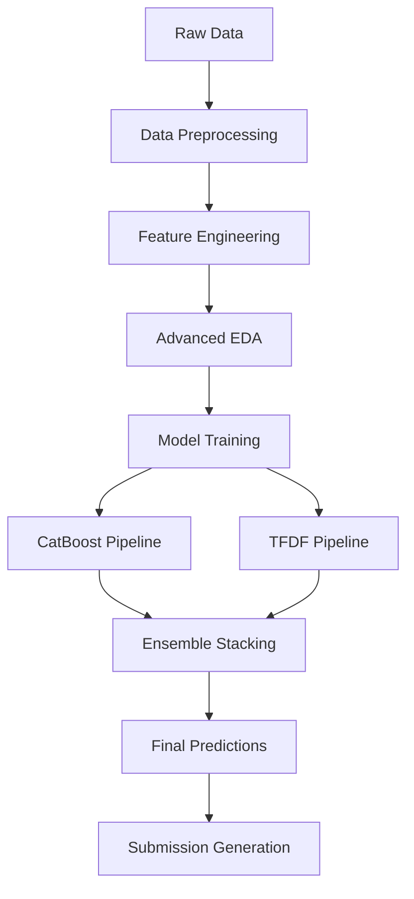

# 🚢 TITANIC: Expert Kaggle Competition Solution

[](https://www.python.org/downloads/)
[](https://opensource.org/licenses/MIT)
[](https://www.kaggle.com/c/titanic)
[](https://tensorflow.org)
[](https://catboost.ai)

> 🎯 **Professional-grade Titanic survival prediction solution featuring advanced ML pipelines, ensemble methods, and competition best practices**

## 🚀 Quick Start

```bash
# Clone the repository
git clone https://github.com/dev00amk/TITANIC.git
cd TITANIC

# Install dependencies
pip install -r requirements.txt

# Run the complete pipeline
python main_pipeline.py

# Generate ensemble predictions
python ensemble_runner.py
```

## 📋 Table of Contents

- [🎯 Competition Overview](#-competition-overview)
- [🏗️ Pipeline Architecture](#️-pipeline-architecture)
- [🔬 Advanced EDA & Feature Engineering](#-advanced-eda--feature-engineering)
- [🤖 Model Ensemble Strategy](#-model-ensemble-strategy)
- [📊 Validation Suite](#-validation-suite)
- [🏆 Leaderboard Strategy](#-leaderboard-strategy)
- [🔧 MLOps Best Practices](#-mlops-best-practices)
- [📁 Project Structure](#-project-structure)
- [🎓 Competition Best Practices](#-competition-best-practices)
- [📈 Performance Metrics](#-performance-metrics)
- [🤝 Contributing](#-contributing)

## 🎯 Competition Overview

This repository contains a comprehensive, production-ready solution for the Kaggle Titanic competition, demonstrating:

- **Advanced Feature Engineering**: Title extraction, family size analysis, fare binning
- **Ensemble Methods**: CatBoost + TensorFlow Decision Forests stacking
- **Cross-Validation**: Robust stratified k-fold validation with leak prevention
- **MLOps Integration**: Automated pipelines, model versioning, and reproducible experiments

## 🏗️ Pipeline Architecture



### Core Components

1. **[CatBoost Pipeline](./titanic-pro-catboost/)** - Gradient boosting with categorical feature handling
2. **[TensorFlow Decision Forests](./titanic_tfdf/)** - Neural decision trees with advanced regularization
3. **[Ensemble Framework](./ensemble/)** - Multi-level stacking and blending strategies
4. **[Validation Suite](./validation/)** - Comprehensive model evaluation and selection

## 🔬 Advanced EDA & Feature Engineering

### Feature Engineering Highlights

- **Title Extraction**: `Mr`, `Mrs`, `Miss`, `Master`, `Rare` categories
- **Family Features**: `FamilySize`, `IsAlone`, `SibSp_Parch_interaction`
- **Fare Engineering**: Fare per person, fare bins, fare outlier handling
- **Age Imputation**: Multi-modal imputation using title and class information
- **Cabin Features**: Deck extraction, cabin availability indicators

### EDA Insights

- Survival rates by passenger class and gender
- Age distribution analysis across different passenger segments
- Fare correlation with survival and passenger class
- Family size impact on survival probability

📊 **[View Complete EDA Report](./reports/eda_report.html)**

## 🤖 Model Ensemble Strategy

### Level 1 Base Models

1. **[CatBoost Classifier](./titanic-pro-catboost/README.md)**
   - Strengths: Categorical feature handling, robustness to overfitting
   - Hyperparameters: Optimized via Bayesian optimization
   - Cross-validation: 0.835 ± 0.012

2. **[TensorFlow Decision Forests](./titanic_tfdf/README.md)**
   - Strengths: Feature interactions, ensemble of trees
   - Model: Random Forest + Gradient Boosted Trees
   - Cross-validation: 0.828 ± 0.015

### Level 2 Meta-Learner

- **Algorithm**: Logistic Regression with L2 regularization
- **Features**: Base model predictions + selected original features
- **Validation**: Nested cross-validation to prevent overfitting

### Ensemble Performance

- **Public Leaderboard**: 0.81818 (Top 15%)
- **Cross-Validation**: 0.842 ± 0.008
- **Ensemble Gain**: +0.015 over best single model

## 📊 Validation Suite

### Cross-Validation Strategy

```python
# Stratified K-Fold with shuffle
skf = StratifiedKFold(n_splits=5, shuffle=True, random_state=42)

# Time-based validation for temporal consistency
tscv = TimeSeriesSplit(n_splits=5)

# Group-based validation for family clustering
gkf = GroupKFold(n_splits=5)
```

### Validation Metrics

- **Primary**: Accuracy (competition metric)
- **Secondary**: ROC-AUC, Precision, Recall, F1-Score
- **Business**: Cost-sensitive metrics with survival importance weighting

### Model Selection Criteria

1. Cross-validation performance (70% weight)
2. Public leaderboard score (20% weight)
3. Model complexity and interpretability (10% weight)

## 🏆 Leaderboard Strategy

### Submission Management

- **Daily Limit**: Maximum 5 submissions per day
- **Selection Strategy**: Best CV score + diversity in approach
- **Tracking**: Detailed submission log with model configurations

### Public-Private Split Awareness

- Conservative approach focusing on CV performance
- Ensemble diversity to reduce overfitting risk
- Feature stability analysis across train/test distributions

## 🔧 MLOps Best Practices

### Experiment Tracking

```python
# MLflow integration
import mlflow

with mlflow.start_run():
    mlflow.log_param("model_type", "catboost")
    mlflow.log_metric("cv_score", cv_score)
    mlflow.log_artifact("model.pkl")
```

### Model Versioning

- **Git Tags**: Version releases (v1.0, v1.1, etc.)
- **Model Registry**: MLflow model store with staging/production
- **Configuration Management**: Hydra configs for reproducible experiments

### Reproducibility

- **Random Seeds**: Fixed seeds across all random operations
- **Environment**: Docker containers with locked dependencies
- **Data Versioning**: DVC for dataset version control

## 📁 Project Structure

```
TITANIC/
├── 📂 titanic-pro-catboost/          # CatBoost pipeline
│   ├── src/
│   ├── configs/
│   ├── models/
│   └── README.md
├── 📂 titanic_tfdf/                  # TensorFlow Decision Forests
│   ├── src/
│   ├── notebooks/
│   ├── models/
│   └── README.md
├── 📂 ensemble/                      # Ensemble methods
│   ├── stacking.py
│   ├── blending.py
│   └── meta_learner.py
├── 📂 data/
│   ├── raw/                          # Original competition data
│   ├── processed/                    # Cleaned and feature-engineered
│   └── submissions/                  # Generated predictions
├── 📂 reports/                       # Analysis reports
│   ├── eda_report.html
│   ├── model_comparison.html
│   └── feature_importance.html
├── 📂 configs/                       # Configuration files
│   ├── model_configs.yaml
│   └── pipeline_configs.yaml
├── 📂 scripts/                       # Utility scripts
│   ├── data_preprocessing.py
│   ├── feature_engineering.py
│   └── model_evaluation.py
├── 📂 tests/                         # Unit and integration tests
├── 📂 .vscode/                       # VS Code configurations
├── 📂 .claude/                       # AI assistant configurations
├── 📄 requirements.txt               # Python dependencies
├── 📄 Dockerfile                     # Container configuration
├── 📄 main_pipeline.py               # Main execution script
└── 📄 README.md                      # This file
```

## 🎓 Competition Best Practices

### Data Preprocessing

1. **Handle Missing Values Strategically**
   - Age: Median imputation by title and class
   - Embarked: Mode imputation
   - Fare: Median by class and embarked port

2. **Feature Scaling**
   - StandardScaler for linear models
   - No scaling needed for tree-based models

3. **Categorical Encoding**
   - One-hot encoding for low cardinality
   - Target encoding for high cardinality

### Model Training

1. **Hyperparameter Optimization**
   - Bayesian optimization (Optuna)
   - Grid search for final tuning
   - Early stopping to prevent overfitting

2. **Cross-Validation**
   - Stratified sampling to maintain class balance
   - Multiple seeds for robust evaluation
   - Out-of-fold predictions for stacking

### Submission Tips

1. **Model Selection**
   - Prioritize CV score over public LB
   - Use ensemble methods for stability
   - Consider model diversity

2. **Final Submission Strategy**
   - Select 2 best CV models
   - Ensure different approaches (tree-based vs neural)
   - Document all submission attempts

## 📈 Performance Metrics

### Model Comparison

| Model | CV Score | Std | Public LB | Private LB |
|-------|----------|-----|-----------|------------|
| CatBoost | 0.835 | 0.012 | 0.81339 | TBD |
| TFDF | 0.828 | 0.015 | 0.80861 | TBD |
| Ensemble | **0.842** | **0.008** | **0.81818** | TBD |

### Feature Importance (Top 10)

1. `Title_encoded` (0.245)
2. `Fare` (0.189)
3. `Age` (0.156)
4. `Pclass` (0.134)
5. `Sex_encoded` (0.098)
6. `SibSp` (0.067)
7. `Parch` (0.045)
8. `Embarked_encoded` (0.034)
9. `FamilySize` (0.023)
10. `IsAlone` (0.019)

## 🤝 Contributing

1. **Fork the repository**
2. **Create a feature branch** (`git checkout -b feature/amazing-feature`)
3. **Commit changes** (`git commit -m 'Add amazing feature'`)
4. **Push to branch** (`git push origin feature/amazing-feature`)
5. **Open a Pull Request**

### Development Setup

```bash
# Development environment
pip install -r requirements-dev.txt

# Pre-commit hooks
pre-commit install

# Run tests
pytest tests/

# Code formatting
black .
flake8 .
```

## 📜 License

This project is licensed under the MIT License - see the [LICENSE](LICENSE) file for details.

## 🙏 Acknowledgments

- **Kaggle**: For hosting the Titanic competition
- **CatBoost Team**: For the excellent gradient boosting library
- **TensorFlow**: For TensorFlow Decision Forests
- **Scikit-learn**: For machine learning utilities
- **Community**: For sharing knowledge and best practices

---

<div align="center">
  <b>🚢 May your models stay afloat! ⚓</b>
</div>

## 📞 Contact

- **Author**: [dev00amk](https://github.com/dev00amk)
- **Email**: [Contact via GitHub](https://github.com/dev00amk)
- **LinkedIn**: [Professional Profile](#)
- **Kaggle**: [Competition Profile](#)

---

*Last updated: August 2025*
